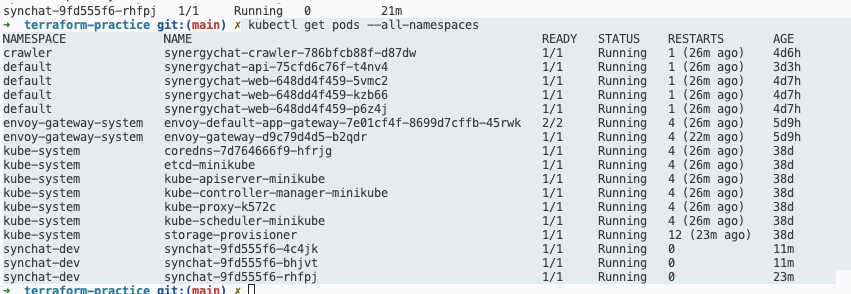

# Infrastructure environments

| Environment | Terraform state key | Kubernetes namespace | Database | Release approval |
|---|---|---|---|---|
| MiniStack/dev | `ministack/dev/terraform.tfstate` | `synchat-dev` | Local/MiniStack PostgreSQL | Automatic |
| Stage | `aws/stage/terraform.tfstate` | `synchat-stage` | Managed PostgreSQL | Manual promotion |
| Production | `aws/prod/terraform.tfstate` | `synchat-prod` | Managed PostgreSQL | Protected approval |

## Ownership

| Tool | Owns |
|---|---|
| Terraform | VPC, EKS, ECR, PostgreSQL, IAM, S3, Terraform state backend |
| Helm | Deployments, Services, ConfigMaps, probes, resource limits |
| Argo CD | Synchronizing Helm releases into Kubernetes |
| GitHub Actions | Tests, image builds, image publishing, release proposals |
| Application migrations | PostgreSQL tables and schema changes |

Who creates the EKS cluster?
A: Terraform 

Who creates the API Deployment? 
A: ArgoCD deploys Helm-rendered manifest, Kubernates creates and runs the Deployments/ Pods

Who changes the PostgreSQL schema?
A: Application migration tool like alembic

Who repairs a manually changed replica count?
A: ArgoCD

Why should dev and production use separate Terraform state?
A: To isolate environments, permissions, failures, state locking, and lifecycle

